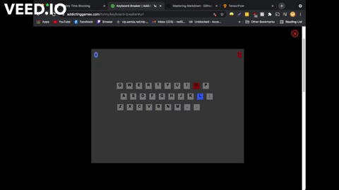

# keyboardBreaker
## Overview
KeyboardBreaker is a computer vision project made to automatically play the game [keyboard breaker](https://www.addictinggames.com/funny/keyboard-breaker#url). 

The project orignally ran by detecting the colour blue, grabbing the area of the letter, converting it to grayscale and then parsing it through [pytesseract](https://pypi.org/project/pytesseract/). However, this was very ineffcient and ended up barely being able to beat the easiest difficulty. Therefore the project pivoted to using a simple neural netowrk. Therefore, [tensorflow](https://www.tensorflow.org/) is required for this project.

## Setup
There are a few steps to setting this up to work on your machine.

* First install requirements.txt
* Install pytesseract: [windows](https://medium.com/@marioruizgonzalez.mx/how-install-tesseract-orc-and-pytesseract-on-windows-68f011ad8b9b), [mac](https://guides.library.illinois.edu/c.php?g=347520&p=4121425)
* You may need to change the [MSS version](https://python-mss.readthedocs.io/api.html) in KeyboardBreaker to your system version.

## Playing the Game
To play the game simply load up the game and wait till the main menu (after the addictinggames logo). You should now be able to run main.py. This may take a few seconds as it's loading in the tensorflow model. When this is loaded, the screen location will be found and the game will automatically load into a hard mode game and destroy the competition. While a game is won by either side the bot will not attempt to press any more keys.

## Training the neural Network
To train the neural network yourself you'll need to grab images using the datagetter.py module. This currently still runs off of pytesseract so is not as efficient as it could be. Moreover, you also need to manually locate the screen valeus (Sorry!). You will also need to create an output folder in the keyboardbreaker directory.  After that, you simply just start a game and let it run. it will automatically play new games and take new screenshots of letters to use to be trained on. Currently pytesseract will predict the letter and place it in the folder. If it is not sure it will put it in unknown. You should manually go into the folders and take out incorrect data if you plan on training this! Currently the best accuracy I could get with all the screen characters on a dataset of 800 training images was 93.5%. See if you can beat me!

## Credits
Thanks to [ClarityCoders](https://www.youtube.com/c/ClarityCoders) for inspiring this project from his [fastwords project](https://github.com/ClarityCoders/FastWords)

Thanks to [Praveen for his hsvfinder implementation](https://medium.com/programming-fever/how-to-find-hsv-range-of-an-object-for-computer-vision-applications-254a8eb039fc) that I modified to find the correct hsv values for the different shades of blue seen in this project.

Thanks to [codebasics for his digit classification video](https://www.youtube.com/watch?v=iqQgED9vV7k) that gave me some good information about the neural network problem space. 